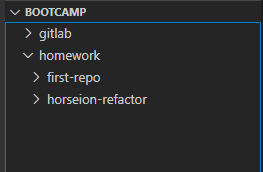
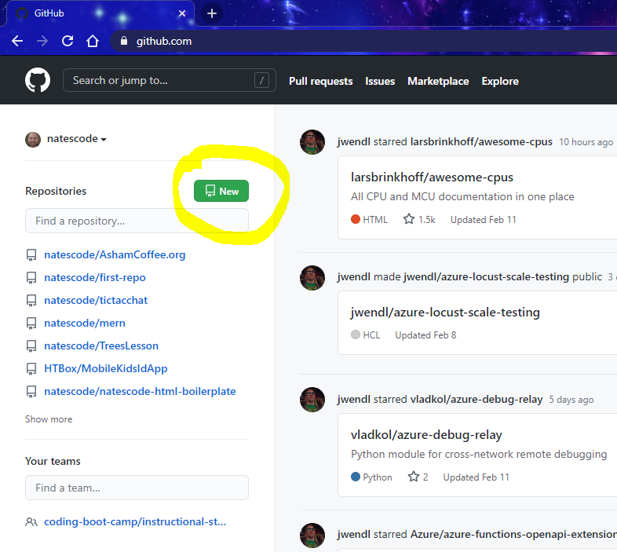
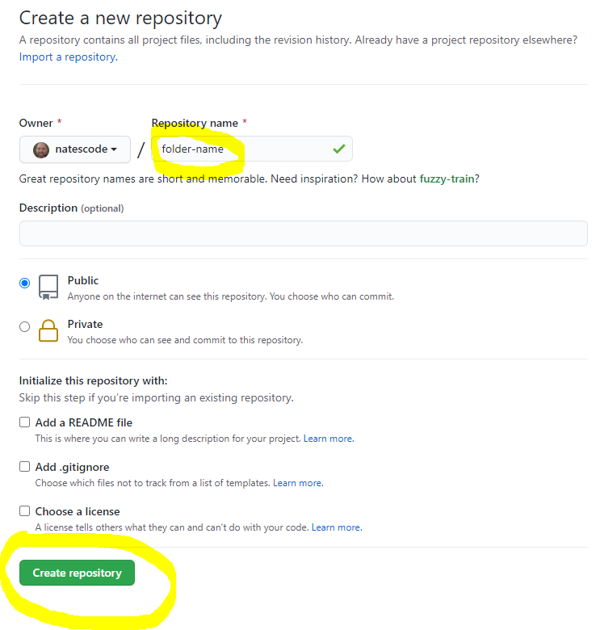
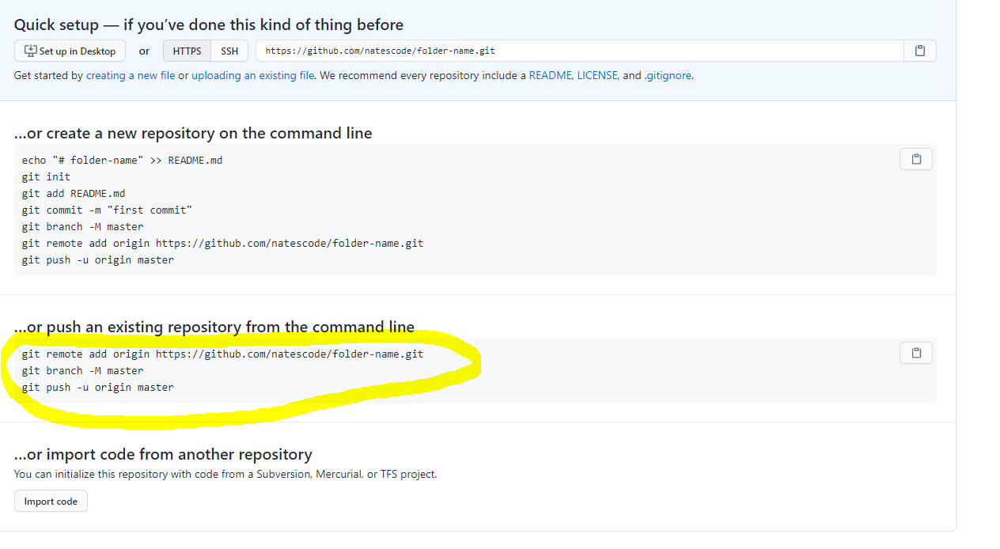

# GIT CHEAT SHEET

## NEW PROJECT

First create a new folder for the project (I recommend under a 'bootcamp' folder that also has a 'gitlab' folder ).

**Example:**

Create a new folder (I use 'folder-name' as an example folder / project / repo name).

1)  (In VS Code) -> Right Click project folder -> "Open In Integrated Terminal"

**Example:**

2) (In terminal) `git init` (enter)

3) `git add .` (enter)

4) `git commit -m "Initial Commit"` (enter)

5) (In Chrome) github.com -> New (top left green button for new repo(sitories))
    a) Give the project (repo) the same name as the folder 
    b) (button) Create Repository

**EXAMPLE**

6) (In terminal) 
copy the commands from github and paste into terminal (you may have to hit enter again).

**(YOUR github.com URL will be different)**

**EXAMPLE**

    // EXAMPLE
    git remote add origin https://github.com/natescode/folder-name.git
    git branch -M master
    git push -u origin master

---
## SAVE and PUBLISH to github
    
    git add .
    git commit -m "your message of what you changed"
    git pull
    git push