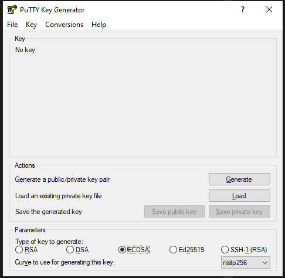
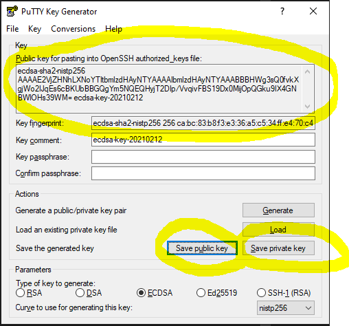
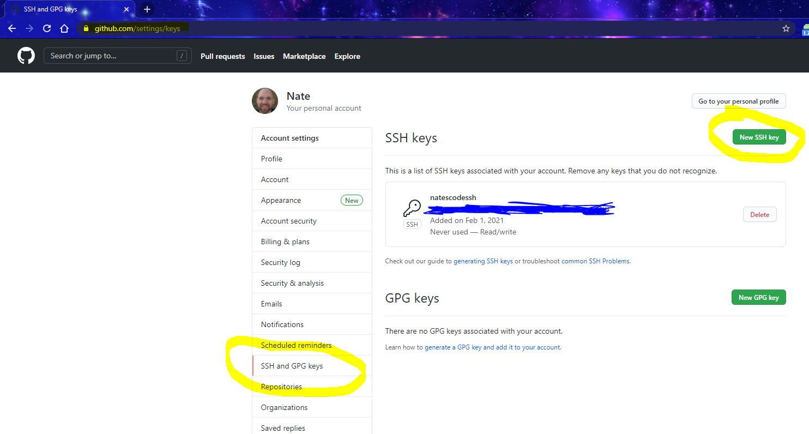
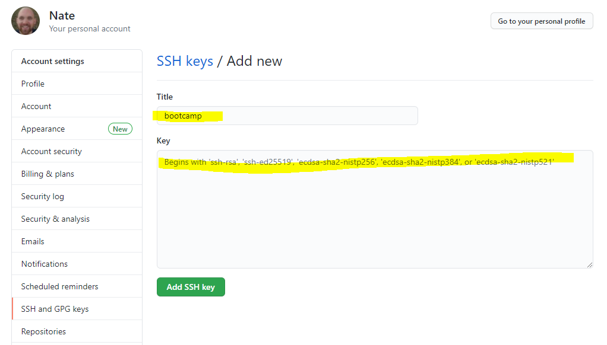
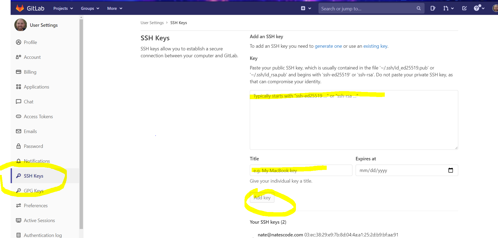

# SSH Keys

1) Download [PuTTY](https://www.putty.org)
2) Run PuTTYgen
3) Generate a new SSH Key. Hit *Generate* and move your mouse randomly.

**EXAMPLE**

4) Save the *Public Key* and the *Private Key*. Copy the top text to Github and Gitlab.

**EXAMPLE**

### **GITHUB**
---

Settings -> SSH & GPG Keys

### **GITLAB**
---

Preferences -> SSH Keys

